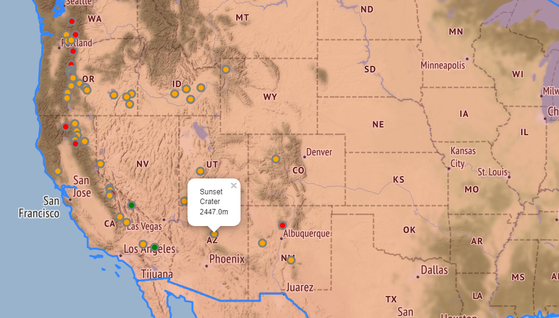
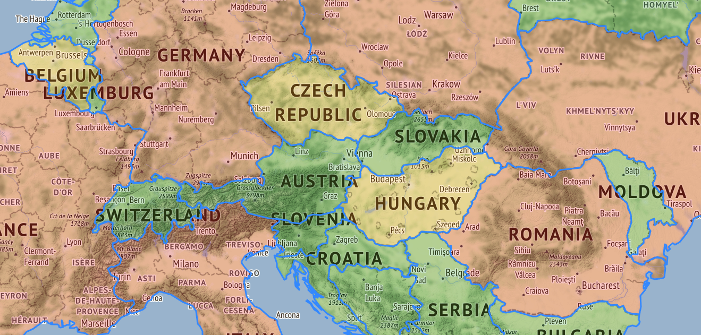

 # Volcano Mapping
 ## Project Information
This script uses folium to create a map in html. The map starts centered in the United States where you can find markers for various volcanoes. When the cursor is placed over a marker a pop up will display the volcanoes name and height in meters. Each marker is colored based on height, red being the taller volcanoes, green being the shorter volcanoes, and yellow being in between. When the user zooms out to view the rest of the world, they will notice countries are colored coated as well. This coloring is similar to the volcano markers except the colors represent popluation instead of height.

The main objective was to practice the use of the Folium library, when creating a map, in Python. Also excercised the use of pandas dataframes when creating feature groups. 

 
 

